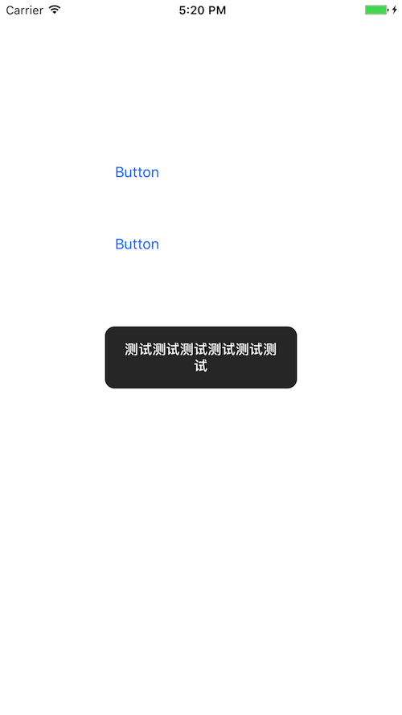
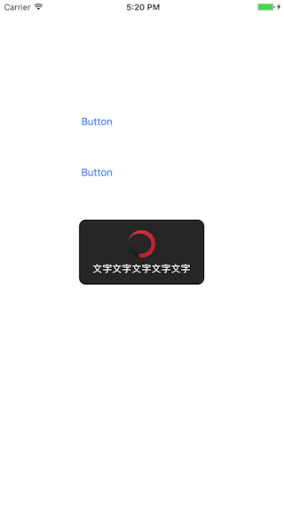
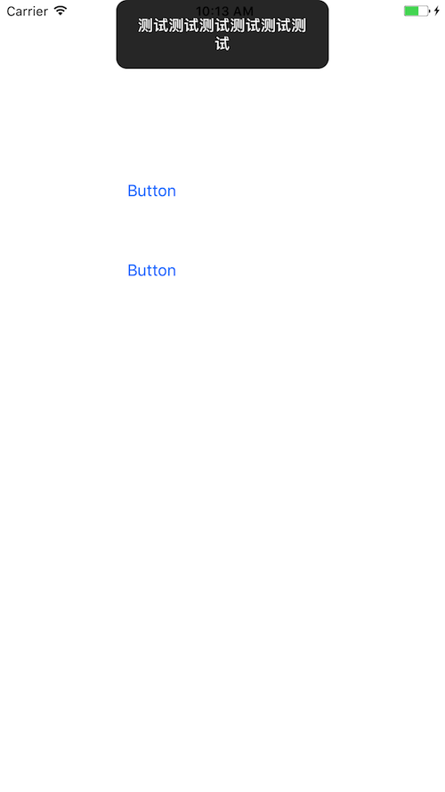
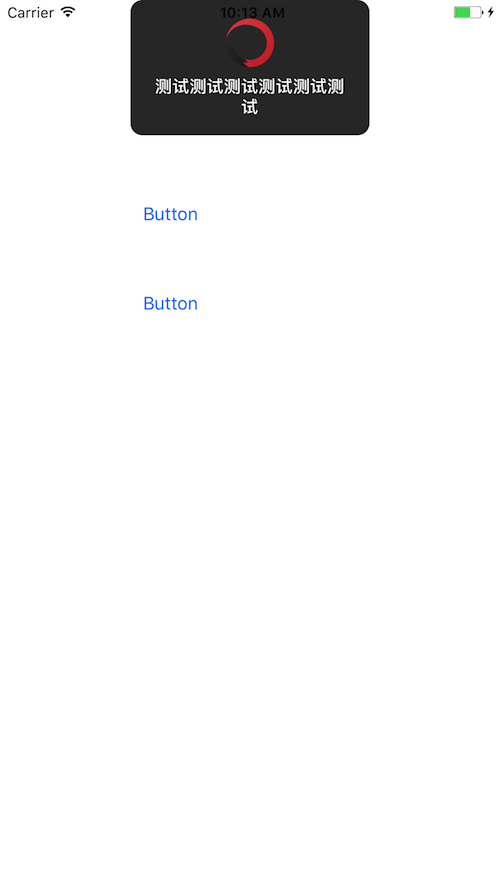

----
弱提示弹框


pod 初始化

```objc
pod 'HLAlert'
pod install

```


使用方式:

```objc

    [self postMessage:@"测试测试测试测试测试测试"];
    [self postMessage:@"测试测试测试测试测试测试" image:[UIImage imageNamed:@"SVLoadingView"]];
```

或者 

```objc
    [[HLAlertCenter defaultCenter] postAlertWithMessage:@"测试测试测试测试测试测试"];
    [[HLAlertCenter defaultCenter] postAlertWithMessage:@"测试测试测试测试测试测试"  image:[UIImage imageNamed:@"SVLoadingView"]];

```

效果图如下：




```objc
 [[HLAlertCenter defaultCenter] postMessage:@"测试测试测试测试测试测试" origin_y:0];
 [[HLAlertCenter defaultCenter] postMessage:@"测试测试测试测试测试测试" image:[UIImage imageNamed:@"SVLoadingView"]];

````


或者

```objc
[[HLAlertCenter defaultCenter] postMessage:@"测试测试测试测试测试测试" origin_y:0];
[[HLAlertCenter defaultCenter] postMessage:@"测试测试测试测试测试测试" image:[UIImage imageNamed:@"SVLoadingView"]];


```

效果图如下：


